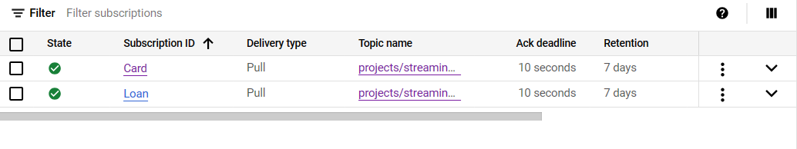

# Real-time Loan Fraud Detection from Streaming Card and Loan Data
โปรเจคนี้จะ detect ข้อมูลแบบ real-time จากสองที่มาคือ Card data และ Loan data ซึ่งจะทำการ generate 
ข้อมูลและส่งไปที่ topic ที่สร้างไว้ 2 topics คือ Card topic และ Loan topic โดยใช้บริการ global real-time messaging 
ของ google cloud platform และสร้าง subscription เพื่อรับข้อมูลที่ได้ generate ออกมา 2 topics คือ Card topic 
และ Loan topic เช่นกัน เพื่อทำการประมวลผลตาม Requirements ที่ได้กำหนดไว้เพื่อตรวจจับการโฉ้โกงเงินกู้และบันทึกลงใน Big query
เพื่อนำไปวิเคราะห์ข้อมูลต่อไป 

# ตัวอย่างข้อมูลทีทำการ Generate ขึ้น
ข้อมูลที่ Generate ทำการ Generate ขึ้นจาก 2 ที่ซึ่ง Generate จากไฟล์ Generate_loan_data.py คือ \
1. Card data เป็นข้อมูลต่างๆของ Card ซึ่งมีจำนวน 8 Columns คือ \
 1.1 Customer_id ซึ่งคือ unique customer identification ของเจ้าของบัตร \
 1.2 Relationship_no คือ Relationship number of Card \
 1.3 Card_type คือประเภทของบัตรซึ่งมี 8 ประเภทคือ 1.Issuers 2.AccountNow_Prepaid_Cards 3.MasterCard 4.Discover 5.Capital_One 6.American_Express 7.Network 
 8.Visa \
 1.4 Max_credit_limit คือ max spent limit ของ customer ใน 1 เดือน \
 1.5 Total_Spent คือ ค่าใช้จ่ายของ customer ใน 1 เดือน \
 1.6 Cash_withdrwn คือ จำนวนเงินที่ customer ถอน ใน 1 เดือนจากตู้ ATM ซึ่งรวมอยู่ใน Total_Spent เรียบร้อย \
 1.7 Cleared_amount คือ การชำระค่าใช้จ่ายของ customer ใน 1 เดือน\
 1.8 Last_date คือ วันสุดท้ายของเดือนและเป็นวัยสุดท้ายในการชำระเงินนั่นเอง โดยกำหนดทุกปีเป็น 2019 \  
2. Loan data เป็นข้อมูลเงินกู้ของ customer ต่างๆซึ่งมี 7 Columns คือ\
 2.1 Customer_id คือ unique identification ของเจ้าของบัตร \
 2.2 Customer_category คือ หมวดหมู่ของ customer ซึ่งมี 5 ประเภทคือ 1.Serviceman 2.Businessman 3.Student 4.Others 5.Self \
 2.3 Loan_id คือ  unique loan identification ของ customer นั้นๆ \
 2.4 Loan_category คือ หมวดหมู่ของเงินกู้ ซึ่งมี 3 ประเภทคือ 1.Medical_Loan 2.Personal_Loan 3.Education_Loan \
 2.5 Due_date คือ วันที่ครบกำหนดการผ่อนชำระสำหรับเดือนนั้นๆ โดยกำหนดทุกปีเป็น 2019 
 2.6 Due_amount คือ จำนวนเงินค่างวดที่ครบกำหนด \
 2.7 Payment_date คือ วันที่ชำระเงินจริง โดยกำหนดทุกปีเป็น 2019 

# Requirements ที่กำหนดในการตรวจสอบเิงนกู้ว่าเป็นการฉ้อโกงหรทอไม่
1. Credit card data:\
1.1 กำหนดให้ customer ได้รับ 1 คะแนนในกรณีที่ชำระเงินไม่ครบตามที่กำหนด ซึ่งหมายความว่าลูกค้าไม่สามารถชำระเงินได้ตั้งแต่ 80% ของยอดการใช้จ่ายรายเดือนของเขาขึ้นไป \
1.2 กำหนดให้ customer ได้รับ 1 คะแนนในกรณีที่ลูกค้าใช้จ่ายจำนวนเต็มของวงเงินสูงสุดของเขา แต่ไม่ชำระเต็มจำนวนที่ครบกำหนด \
1.3 หาก customer ตรงตามทั้งสองเงื่อนไขด้านบนในเดือนใดๆ กำหนดให้ลูกค้าได้รับ 1 คะแนนเพิ่มเติม \
2. Loan data requirements:\
2.1 สำหรับประเภทสินเชื่อบุคคล (personal loan) ธนาคารไม่ยอมรับการชำระเงินไม่ครบตามกำหนดหรือชำระเกินกำหนดเวลา หากบุคคลไม่ได้ชำระค่างวดรายเดือน
3. Loan defaulter:\
3.1 ถ้า customer ไม่ได้ชำระเงินผิดกำหนดทั้งหมด 4 งวดขึ้นไป หรือไม่ได้ชำระเงินผิดกำหนดติดต่อกัน 2 งวด จะถือว่าเป็นผู้กู้ที่ไม่ชำระเงินสินเชื่อส่วนบุคคลตามกำหนด

# การเตรียมการในทำโปรเจค
1. สร้าง Topics ขึ้นมา 2 Topics คือ Card topic และ Loan topic โดยใช้บริการ pub/sub ของ google cloud platform  

2. สร้าง subcription ของ Card topic และ Loan topic ขึ้นมา 

3. uploadfile Generate_loan_data.py บน Cloud Shell Editor \
4. ทำการ run Generate_loan_data.py บน Cloud Shell Editor  \

  <pre><code>python Generate_loan_data.py</code></pre>

5. ทำการสร้าง Bigquery เพื่อรับข้อมูลโดย Dataset ต้องมี Region เดียวกับ cloud storage ในขั้นตอนถัดไป \
และมี จำนวน Column 4 Columns ดังนี้ \

6. \

